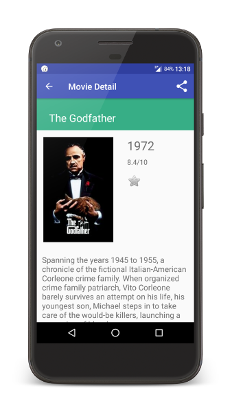

# Popular Movies

**Popular Movies** is one of the projects I made from scratch for Udacity's [*Associate Android Developer Fast Track*](https://www.udacity.com/course/associate-android-developer-fast-track--nd818) course supported by Google.
The app uses core Android UI components and fetches movie details using themoviedb.org free API.

# Features

* See a grid of the most popular or the highest rated movies,
* Read reviews,
* Store and view selected movies' details offline,
* Watch and share trailers,
* Seamlessly update movies in background thread.

# Screenshots

# How to run

You need to enter your own API key for The Movie Database API in order to fetch the movies.
Do steps as described below to run the app.

  1. Copy the project
  2. Get your own *API key* from https://www.themoviedb.org/settings/api .
  3. In [`app/src/main/res/values`](app/src/main/res/values) create new resource file with name `movie_db_api.xml`.
  4. Use [`movie_db_api.xml.example`](app/src/main/res/values/movie_db_api.xml.example#L3) to paste contents of the newly created file
  5. Uncomment line with key
  6. Enter your key instead of `PutYourKeyHere`
  7. Run the app! 👍
 

# Project requirements

This project was reviewed by Udacity code reviewer and was graded positively as it met the requested specifications. To see it in detail refer to [this wiki page](../../wiki/Project-requirements)

# Libraries used

* [ButterKnife](https://github.com/JakeWharton/butterknife) - Fields and methods binding for Android views
* [Firebase JobDispatcher](https://github.com/firebase/firebase-jobdispatcher-android) - Background jobs scheduler
* [Picasso](https://github.com/square/picasso) - Image downloading and caching library

# License

Copyright 2017 Szymon Koper

Licensed under the Apache License, Version 2.0 (the "License");
you may not use this file except in compliance with the License.
You may obtain a copy of the License at

    http://www.apache.org/licenses/LICENSE-2.0

Unless required by applicable law or agreed to in writing, software
distributed under the License is distributed on an "AS IS" BASIS,
WITHOUT WARRANTIES OR CONDITIONS OF ANY KIND, either express or implied.
See the License for the specific language governing permissions and
limitations under the License.
